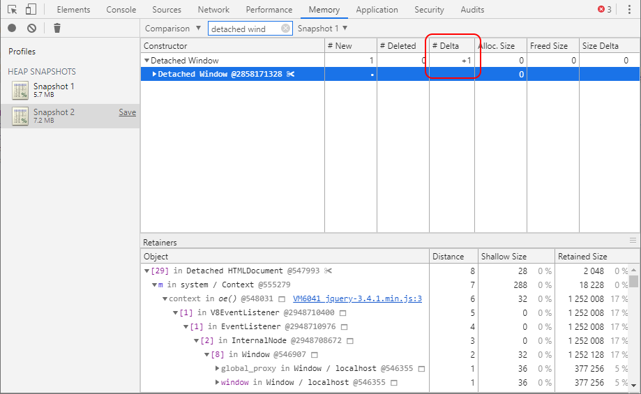
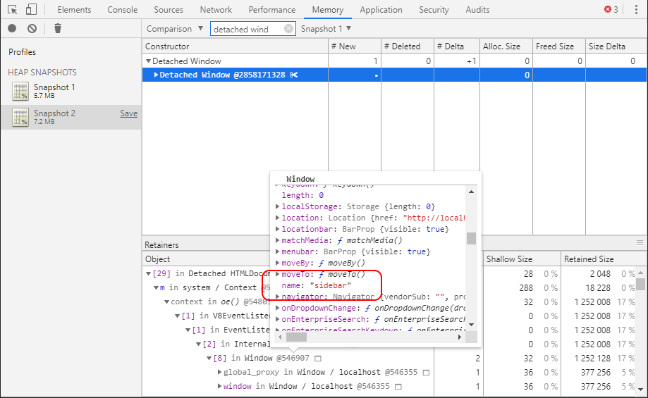
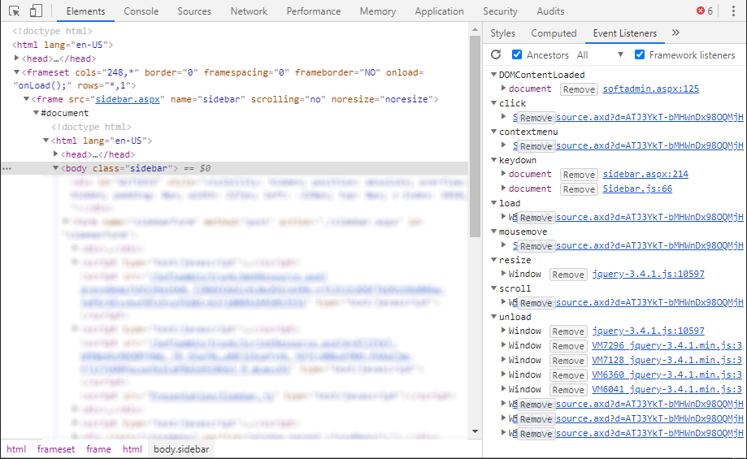
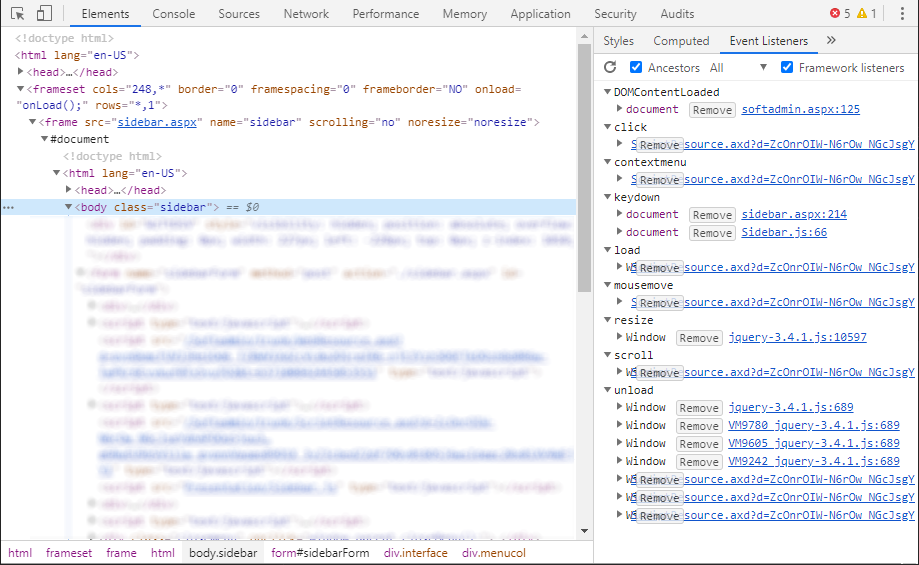
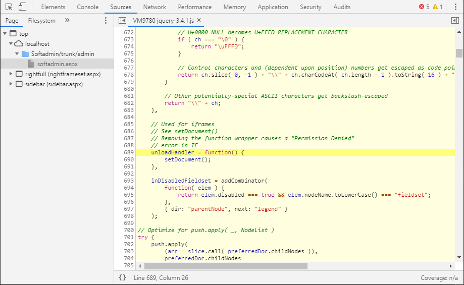
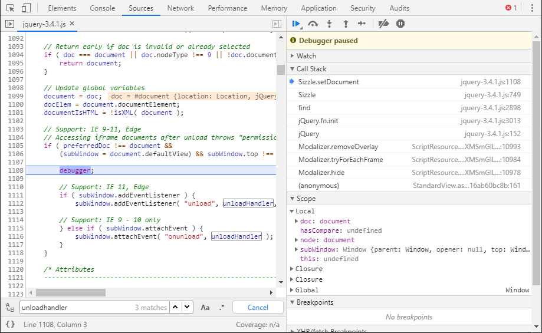
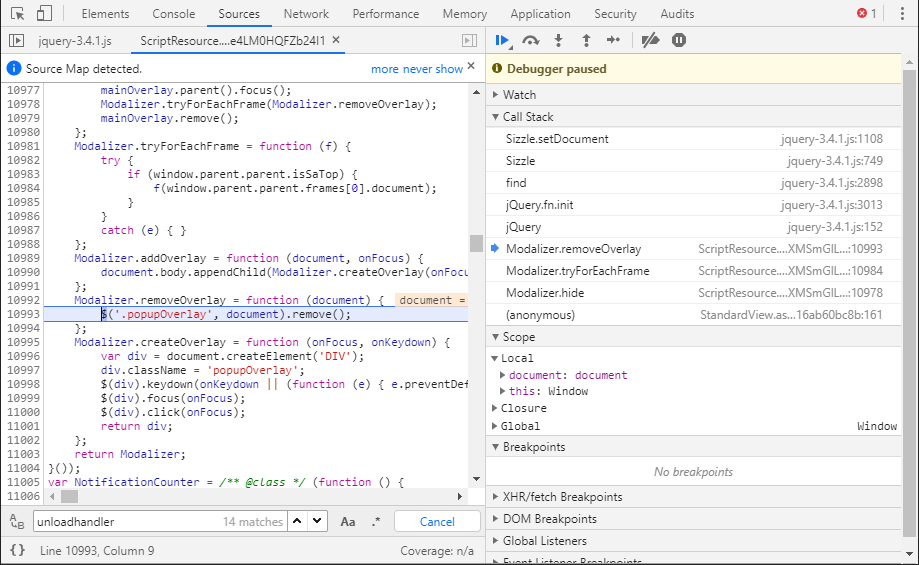
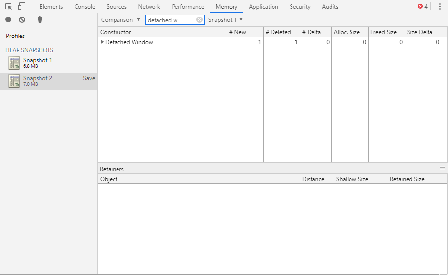

# JavaScript memory leaks, a detached window

Our web application contains several memory leaks, the most alarming being a Detached Window. When a user navigates to a new screen in the application a reference to the old screen is retained. Forever.

This text describes *how* I located the source of the detached window. It is not necessarily the most efficient way of doing so.

Using Chrome's memory tools to take a heap snapshot before and after navigating and then comparing the two I can see that yes, among other things we are leaking a Detached Window.

I can see by looking at the Retainers path that the detached window is retained by its document, which is in turn retained by an event listener. It looks like the event listener was attached using jQuery, which is not surprising as that's what we normally use. Unfortunately there does not seem to be a way to tell **which** event it is listening on.

By scanning through the properties of the window that retains the event listener I can find its name property, *sidebar*. So it looks like I should check event listeners on the sidebar frame. This sounds plausible: the main frame is reloaded for each navigation while the sidebar frame stays the same.

Checking the event listeners on the sidebar does not give anything immediately obvious. I perform the leaking navigation a few more times, and now I can see that I have a considerable amount of *unload* listeners.

 It's hard to tell more with a minified jQuery so I switch to the development version of jQuery (which I should have done from the start).

Now I can see where the unload handler is declared, and see that it is a jQuery declared handler and not one of our own.

I still do not know *how* the event listener is added. I modify the jQuery script to add a programmatic breakpoint.

Looking at the Call Stack I can now see that it is our class Modalizer which is guilty.

Moving upp the call stack I can see that Modalizer uses jQuery to query for elements in another frame, and this in turn is what causes jQuery to add the unload handler.

I rewrite removeOverlay to use `querySelectorAll` instead of jQuery, take a memory snapshot, perform the previously leaky navigation and take another snapshot.

Looking at the new delta I can see that we are no longer leaking any detached windows. Looking at the heap size I can tell that there is still work to be done, as there's still a 0.2 MB leak for each navigation. Still, the detached window is solved and that is enough for today.
